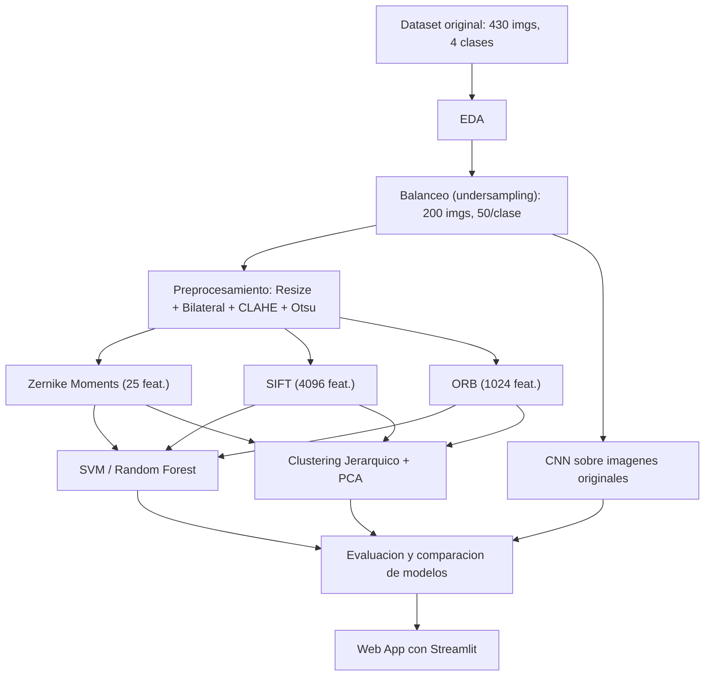

# Integrador-EthnicEcuadorian-Clasificador

<div align="center">

# 🔬 Proyecto Integrador — Visión por Computador & Machine Learning

### Clasificación de grupos étnicos ecuatorianos: de los descriptores clásicos a las redes neuronales

*Comparación de Momentos de Zernike, SIFT y ORB frente a una CNN entrenada desde cero, más Clustering Jerárquico no supervisado y una aplicación web interactiva.*


</div>

---

Este repositorio contiene el desarrollo del **Proyecto Integrador (P68)** de Visión por Computador y Aprendizaje Automático: un pipeline completo que va desde el análisis exploratorio de un dataset de rostros hasta una aplicación web funcional, pasando por preprocesamiento de imágenes, extracción de características clásicas, clasificación supervisada, clustering no supervisado y una CNN entrenada desde cero.

## 📑 Tabla de Contenidos

- [📖 Descripción del Proyecto](#descripción-del-proyecto)
- [🎯 Objetivos](#objetivos)
- [🗂️ Dataset](#dataset)
- [🧩 Metodología y Pipeline](#metodología-y-pipeline)
- [📊 Resultados Principales](#resultados-principales)
- [🖥️ Aplicación Web](#aplicación-web)
- [🚀 Cómo Ejecutar el Proyecto](#cómo-ejecutar-el-proyecto)
- [📁 Estructura del Repositorio](#estructura-del-repositorio)
- [🧠 Stack Tecnológico](#stack-tecnológico)
- [🔎 Conclusiones y Limitaciones](#conclusiones-y-limitaciones)
- [📚 Cómo Citar este Proyecto](#cómo-citar-este-proyecto)
- [👥 Integrantes del Equipo](#integrantes-del-equipo)
- [📄 Licencia y Uso Responsable](#licencia-y-uso-responsable)

---

## 📖 Descripción del Proyecto

Este proyecto implementa un pipeline completo de **Visión por Computador** y **Aprendizaje Automático** para clasificar imágenes faciales según el grupo étnico de la persona fotografiada, usando el dataset público *"Dataset of Ethnic facial images of Ecuadorian people"*.

A lo largo del notebook se abordan, de principio a fin, las etapas típicas de un proyecto de Machine Learning aplicado a imágenes: carga y análisis exploratorio del dataset, balanceo de clases, preprocesamiento, extracción de características (clásica **y** mediante Deep Learning), entrenamiento y evaluación comparativa de múltiples modelos, aprendizaje no supervisado, y el despliegue de una aplicación web interactiva construida con Streamlit.

## 🎯 Objetivos

- 🔍 Realizar un **análisis exploratorio (EDA)** del dataset y corregir su desbalance de clases mediante *undersampling*.
- 🖼️ Aplicar un **pipeline de preprocesamiento** de imágenes (reducción de ruido, mejora de contraste, binarización) adecuado para la extracción de características.
- 🧬 Extraer y comparar tres técnicas clásicas de extracción de características: **Momentos de Zernike, SIFT y ORB**.
- 🤖 Entrenar y comparar **clasificadores supervisados clásicos** (SVM, Random Forest) frente a una **Red Neuronal Convolucional (CNN)** entrenada desde cero.
- 🌐 Explorar **Aprendizaje No Supervisado** mediante Clustering Jerárquico, evaluando la separabilidad natural de las clases con métricas internas y externas.
- 💻 Desarrollar y desplegar una **aplicación web** (entregable obligatorio) que muestre los resultados comparativos y permita clasificar imágenes nuevas.

## 🗂️ Dataset

Se utiliza el dataset público **[Dataset of Ethnic facial images of Ecuadorian people](https://figshare.com/articles/dataset/Dataset_of_Ethnic_facial_images_of_Ecuadorian_people/8266730)**, publicado en Figshare.

| Característica | Detalle |
|---|---|
| Total original | 430 imágenes |
| Clases | Afroecuatoriano · Europeo descendiente · Indígena · Mestizo |
| Distribución original | 50 · 50 · 50 · 280 (fuerte desbalance, ratio 5.6:1) |
| Resolución de captura | 1920 × 1280 px, a color |
| Condiciones de captura | Fondo blanco, distancia de 1.10 m, iluminación frontal y lateral, postura neutral |
| Consentimiento | Informado, exclusivamente para **fines académicos** |

> ⚖️ **Balanceo aplicado:** dado el fuerte desbalance (Mestizos con 280 instancias frente a 50 del resto), se aplicó **undersampling aleatorio** (`random_state=42`) sobre la clase mayoritaria, dejando el dataset en **50 imágenes por clase (200 en total)**. Todas las fases posteriores del proyecto trabajan exclusivamente sobre este subconjunto balanceado.

## 🧩 Metodología y Pipeline



| Etapa | Técnica / Herramienta | Detalle clave |
|---|---|---|
| **1. Carga y EDA** | `os`, `glob`, `cv2`, `pandas` | Conteo por clase, resolución promedio, formatos de archivo |
| **2. Balanceo** | Undersampling aleatorio (`seed=42`) | Mestizos: 280→50 · Total: 430→200 |
| **3. Preprocesamiento** | Resize 256×256 + Filtro Bilateral + CLAHE + Otsu | Se guardan 2 versiones: binarizada (Otsu) y con contraste mejorado (CLAHE, sin binarizar) |
| **4. Extracción de características** | Momentos de Zernike · SIFT · ORB | 25 · 4096 · 1024 características, respectivamente |
| **5. Clasificación clásica** | SVM (kernel lineal) · Random Forest (100 árboles) | `StandardScaler`, split 70/30 estratificado, `class_weight='balanced'`, 5-fold Stratified CV |
| **6. Deep Learning** | CNN (3 bloques Conv2D + GlobalAvgPooling) | Sobre imágenes originales 128×128 (sin preprocesar), con aumento de datos |
| **7. Clustering** | Agglomerative (`ward`) + PCA (90% varianza) | K=4, evaluado con Silhouette, Índice de Dunn (implementado manualmente), ARI y AMI |
| **8. Evaluación** | Tabla comparativa dinámica | Consolida accuracy / precision / recall / F1 y métricas de clustering |
| **9. App Web** *(obligatoria)* | Streamlit (2 pestañas) | Resultados comparativos + predicción sobre imagen nueva |

<details>
<summary><b>🔬 Nota técnica: por qué SIFT/ORB no usan la imagen binarizada</b></summary>
<br>

La imagen que resulta del pipeline de preprocesamiento (CLAHE + Otsu) queda binarizada (blanco y negro puro). Esto funciona bien para los **Momentos de Zernike** (capturan forma/silueta), pero **SIFT y ORB** perderían la mayor parte de su información de gradiente y textura sobre una imagen binaria. Por eso, en la extracción de características, SIFT y ORB se calculan sobre la versión con **CLAHE sin binarizar**, mientras que los Momentos de Zernike usan la versión **binarizada (Otsu)**.
</details>

<details>
<summary><b>🧠 Arquitectura de la CNN</b></summary>
<br>

```
Input (128×128×3)
   ↓  Data Augmentation: Flip horizontal, Rotación, Zoom, Contraste, Traslación
Conv2D(32, 3×3, relu)  → MaxPooling2D
Conv2D(64, 3×3, relu)  → MaxPooling2D
Conv2D(128, 3×3, relu) → MaxPooling2D
GlobalAveragePooling2D
Dense(128, relu) → Dropout(0.5)
Dense(4, softmax)
```

Optimizador `Adam(lr=5e-4, clipnorm=1.0)` · `EarlyStopping` (patience=12) · `ReduceLROnPlateau` (factor=0.5, patience=5) · 50 épocas, batch size 32.

Con solo ~140 imágenes de entrenamiento tras el balanceo, la red se estancaba desde la primera época viendo cada imagen una sola vez; por eso el set de entrenamiento se repite ×4 (con augmentation distinto en cada pasada) para darle más pasos de gradiente por época sin romper el balance entre clases.
</details>

## 📊 Resultados Principales

> 🏆 **Mejor resultado de esta corrida:** CNN sobre imágenes originales — **Accuracy = 0.583**, F1-macro = 0.565 — al costo de **~1013 s** de entrenamiento (los modelos clásicos entrenan en fracciones de segundo).

### Clasificación (split 70/30 estratificado)

| Descriptor | Clasificador | Accuracy | Precision (macro) | Recall (macro) | F1-macro | Tiempo (s) |
|---|---|:---:|:---:|:---:|:---:|:---:|
| Imagen original (RGB) | **CNN** 🏆 | **0.583** | **0.570** | **0.583** | **0.565** | 1013.25 |
| Momentos de Zernike | SVM | 0.450 | 0.467 | 0.450 | 0.447 | 0.025 |
| ORB | SVM | 0.400 | 0.387 | 0.400 | 0.376 | 0.038 |
| Momentos de Zernike | Random Forest | 0.400 | 0.399 | 0.400 | 0.386 | 0.251 |
| SIFT | Random Forest | 0.367 | 0.371 | 0.367 | 0.365 | 0.484 |
| ORB | Random Forest | 0.367 | 0.335 | 0.367 | 0.342 | 0.372 |
| SIFT | SVM | 0.350 | 0.355 | 0.350 | 0.351 | 0.261 |

### Validación Cruzada (Stratified K-Fold, k=5)

Para ver qué tan estables son los resultados clásicos, se repitió la evaluación con validación cruzada:

| Descriptor | Clasificador | Accuracy CV (media) | Accuracy CV (std) |
|---|---|:---:|:---:|
| ORB | **Random Forest** | **0.445** | 0.062 |
| Momentos de Zernike | SVM | 0.400 | 0.032 |
| Momentos de Zernike | Random Forest | 0.385 | 0.086 |
| ORB | SVM | 0.390 | 0.054 |
| SIFT | Random Forest | 0.350 | 0.057 |
| SIFT | SVM | 0.325 | 0.045 |

> 📌 En el split único, Zernike + SVM lideraba entre los modelos clásicos (0.45); en cross-validation, **ORB + Random Forest** resulta el más fuerte (0.445 ± 0.062). Con solo 200 imágenes balanceadas, el ranking entre modelos clásicos es sensible a la partición usada — la propia desviación estándar (hasta ±0.086) lo confirma.

### Patrones por Clase (según las matrices de confusión)

- 🥇 **Afroecuatoriano** es, con diferencia, la clase mejor clasificada en los **7 modelos** evaluados (recall entre 53% y 87%).
- 🥴 **Mestizo** es consistentemente la clase más difícil (recall entre 13% y 47%), probablemente por tener mayor variabilidad fenotípica interna.
- La ventaja de la CNN se concentra en **Europeo descendiente** (73% de recall vs. 20–40% en los modelos clásicos) e **Indígena** (47% vs. 20–40%) — los modelos clásicos confunden frecuentemente "Europeo descendiente" con "Mestizo" (hasta 10 de 15 casos con Zernike + SVM).

### Clustering Jerárquico (K=4)

| Descriptor | Silhouette | Dunn | ARI | AMI |
|---|:---:|:---:|:---:|:---:|
| Momentos de Zernike | 0.1062 | 0.0942 | 0.0059 | 0.0014 |
| SIFT | -0.0024 | 0.6759 | 0.0077 | 0.0181 |
| ORB | -0.0007 | 0.7037 | **0.0646** | **0.0876** |

<sub>Silhouette y Dunn son métricas **internas** (no usan la etiqueta real); ARI y AMI son métricas **externas** (comparan contra la etnia real).</sub>

- **ORB** obtiene el mejor desempeño (aunque aún bajo) en las métricas externas ARI/AMI — sus clusters son los que mejor, modestamente, se alinean con la etnia real.
- **SIFT y ORB** tienen un Índice de Dunn mucho más alto (~0.68–0.70) que Zernike (~0.09) → sus clusters quedan más separados entre sí, aunque eso no implica que coincidan con la etnia real.
- En general, los valores externos (ARI/AMI ≈ 0) confirman que las 4 etnias no forman grupos naturalmente separables en ninguno de los 3 espacios de características.

## 🖥️ Aplicación Web

Como entregable obligatorio, se construyó una app en **Streamlit** con dos pestañas:

| Pestaña | Contenido |
|---|---|
| 📊 **Resultados Comparativos** | Tablas y gráficas de todos los modelos entrenados (por descriptor y clasificador), matrices de confusión, curvas de entrenamiento de la CNN y resultados de clustering |
| 🔍 **Probar con una imagen nueva** *(extra)* | Permite subir una foto y compara la predicción de los 6 modelos clásicos + la CNN en tiempo real |

> ⚠️ **Limitación conocida (documentada en la propia app):** los modelos se entrenaron con fotos de estudio, con iluminación y encuadre controlados. Una foto en condiciones muy distintas queda fuera del dominio de entrenamiento y puede producir predicciones poco confiables — esto es una limitación esperable del dataset pequeño, no un error de código.

## 🚀 Cómo Ejecutar el Proyecto

### Opción A — Notebook completo (Google Colab, recomendado)

1. Descargar el dataset desde [Figshare](https://figshare.com/articles/dataset/Dataset_of_Ethnic_facial_images_of_Ecuadorian_people/8266730).
2. Subir las carpetas del dataset a Google Drive, en la ruta `MyDrive/Intregrador/8266730/` *(así está escrito literalmente en el código — si prefieres corregir el nombre, solo actualiza la variable `DATASET_PATH` en la celda 2).*
3. Abrir `Integrador.ipynb` en [Google Colab](https://colab.research.google.com/).
4. Ejecutar todas las celdas en orden (`Entorno de ejecución → Ejecutar todas`), autorizando el acceso a Drive cuando se solicite.
5. Los resultados (CSVs, modelos `.joblib` / `.keras`, gráficas) se guardan automáticamente en `MyDrive/Intregrador/outputs/`.

### Opción B — Solo la aplicación web (local)

```bash
git clone <url-de-tu-repositorio>
cd <carpeta-del-repo>/webapp
pip install -r requirements.txt
streamlit run app.py
```

**`requirements.txt` sugerido:**

```
streamlit
opencv-python
numpy
pandas
scikit-learn
tensorflow
mahotas
joblib
matplotlib
Pillow
```

> Necesita los modelos entrenados dentro de `webapp/models/` (generados en la sección 9 del notebook y exportados desde `webapp_export/`).

### Opción C — Todo desde Colab, sin descargar nada

Ejecutar la celda de la sección **9.1** del notebook: instala Streamlit, escribe `app.py` automáticamente y expone la app con un túnel público de Cloudflare (`cloudflared`), ideal para mostrarla en vivo durante una presentación. Se prefiere `cloudflared` sobre `localtunnel`, ya que con este último varios componentes de Streamlit (tablas, botón de carga de imágenes) suelen fallar con errores de módulos JS.

## 📁 Estructura del Repositorio

```
proyecto-integrador-vision-computador/
├── Integrador.ipynb              # Notebook principal (todo el pipeline)
├── README.md                     # Este archivo
└── webapp/
    ├── app.py                    # Aplicación Streamlit
    ├── requirements.txt          # Dependencias de la web app
    ├── models/                   # Modelos entrenados (generados por el notebook)
    │   ├── zernike_svm.joblib
    │   ├── zernike_random_forest.joblib
    │   ├── sift_svm.joblib
    │   ├── sift_random_forest.joblib
    │   ├── orb_svm.joblib
    │   ├── orb_random_forest.joblib
    │   ├── cnn_modelo.keras
    │   └── cnn_label_encoder.joblib
    ├── data/                      # Tablas de resultados (CSV)
    │   ├── comparacion_tecnicas_extraccion.csv
    │   ├── comparacion_final_clasificacion.csv
    │   ├── resultados_cross_validation.csv
    │   └── resultados_clustering.csv
    └── figures/                   # Gráficas generadas por el notebook
        ├── distribucion_original.png
        ├── distribucion_balanceada.png
        ├── cnn_curvas_entrenamiento.png
        ├── cnn_matriz_confusion.png
        ├── matrices_confusion_clasicos.png
        ├── clustering_todos_descriptores.png
        └── dendrograma_clustering.png
```

## 🧠 Stack Tecnológico

**Lenguaje:** Python 3 · **Entorno:** Google Colab

| Categoría | Librerías |
|---|---|
| Datos y archivos | `os`, `glob`, `pathlib`, `numpy`, `pandas` |
| Visión por computador | `opencv-python` (`cv2`), `mahotas`, `Pillow` (`PIL`) |
| Visualización | `matplotlib`, `seaborn` |
| Machine Learning clásico | `scikit-learn` (SVM, Random Forest, StandardScaler, PCA, métricas) |
| Clustering | `scikit-learn` (`AgglomerativeClustering`), `scipy` (dendrogramas, distancias) |
| Deep Learning | `tensorflow` / `keras` (CNN) |
| Persistencia de modelos | `joblib` |
| Entorno y paralelización | `google.colab`, `concurrent.futures.ThreadPoolExecutor` |
| Aplicación web | `streamlit`, `cloudflared` |

## 🔎 Conclusiones y Limitaciones

> ℹ️ Los números de esta sección corresponden a la corrida documentada en los resultados de la app. El notebook trae, además, un párrafo de conclusiones redactado a partir de otra corrida de verificación con cifras algo distintas (allí Zernike + SVM aparecía como el mejor modelo) — la diferencia entre ambas corridas es, en sí misma, una buena muestra de cuánto varían las métricas con un dataset tan pequeño.

1. **Efecto del balanceo:** reducir "Mestizos" de 280 a 50 elimina el sesgo hacia la clase mayoritaria, pero también el dataset total (430→200 imágenes), dejando solo ~140 imágenes de entrenamiento (~35 por clase) — el terreno donde se juegan todas las diferencias de desempeño que siguen.
2. **La CNN fue el mejor modelo en esta corrida:** Accuracy = 0.583 y F1-macro = 0.565, por encima de cualquier combinación clásica. Su ventaja se concentra en las clases "Europeo descendiente" e "Indígena", donde los descriptores clásicos tienden a confundirse con "Mestizo".
3. **Ese desempeño tiene un costo:** la CNN tardó **~1013 s** en entrenar frente a **fracciones de segundo** de los modelos clásicos — más de 4 órdenes de magnitud de diferencia, para una ganancia de apenas ~0.13 en accuracy sobre el mejor clásico.
4. **Entre los modelos clásicos, el ranking depende de cómo se mida:** en el split único, Zernike + SVM lidera (0.45); en validación cruzada de 5 folds, ORB + Random Forest es el más fuerte (0.445 ± 0.062). Con solo 200 imágenes balanceadas, ambos resultados son válidos — simplemente reflejan la varianza propia de un dataset pequeño.
5. **Afroecuatoriano vs. Mestizo:** en los 7 modelos evaluados, "Afroecuatoriano" es sistemáticamente la clase mejor clasificada (53–87% de recall) y "Mestizo" la más difícil (13–47%), un patrón consistente sin importar el descriptor o clasificador usado.
6. **El clustering jerárquico no logra recuperar la etnia real:** los valores de ARI/AMI se mantienen cercanos a 0 en los tres descriptores (ORB es el menos malo, con ARI=0.065 y AMI=0.088), confirmando que la variación intra-clase (pose, iluminación, edad) pesa tanto o más que la variación inter-étnica en estos espacios de características.
7. **Trabajo futuro:** dado lo sensible que es cada métrica a la corrida y a la partición usada, lo ideal sería repetir la evaluación con varias semillas y reportar medias ± desviación estándar. También valdría la pena explorar aumento de datos para los descriptores clásicos, o técnicas híbridas (undersampling moderado + oversampling ligero) que preserven más datos reales sin reintroducir un desbalance marcado.

## 📚 Cómo Citar este Proyecto

Este proyecto utiliza el siguiente dataset; si reutilizas este trabajo, por favor cita también la fuente original:

```
Avilés, J., Toapanta, H., Morillo, P., & Vallejo-Huanga, D. (2019).
Dataset of ethnic facial images of Ecuadorian people [Data set]. Figshare.
https://doi.org/10.6084/m9.figshare.8266730.v3
```

## 👥 Integrantes del Equipo

Proyecto desarrollado por:

| Integrante |
|---|
| 🧑‍💻 **Mateo Espinosa** |
| 🧑‍💻 **Michael Merino** |
| 🧑‍💻 **Erick Morales** |

## 📄 Licencia y Uso Responsable

> **Dataset:** las imágenes fueron recopiladas con el consentimiento informado de cada participante, exclusivamente para **fines académicos** (investigación, publicaciones científicas y repositorios digitales educativos). Este proyecto respeta ese alcance: es un ejercicio educativo de comparación de técnicas de Visión por Computador y Machine Learning, no un sistema de decisión sobre personas reales.

**Código:** este repositorio se comparte con fines educativos como parte de un proyecto universitario.

---

<div align="center">

⭐ Si este proyecto te resultó útil o interesante, considera darle una estrella al repositorio ⭐

</div>
